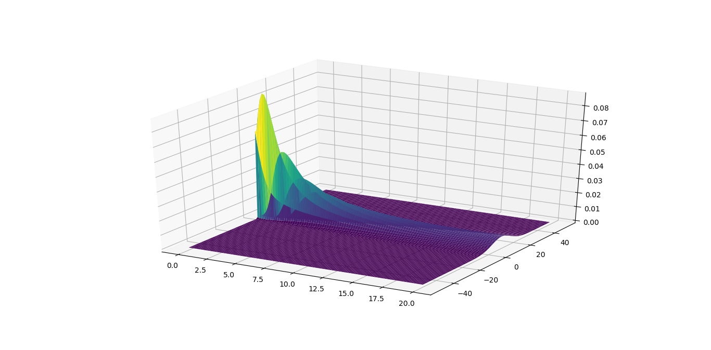

# Lectures and HWs
You can find here some lectures and HWs in TeX-format.

## Stucture 
* [ode_notes][ode] contains lecture notes on numerical methods for solving ordinary differential equations.
* [edu_tasks][edu] is a collection of training programs
* [math_physics][mph] is a draft of Zhislyn's lectures on mathematical physics which are available [here][enabla].
* [mathan][math] is a folder of Savvateev & Tonis's lectures on mathematical analysis, the original videos are [here][sava].
...

[ode]:https://github.com/MrKozelberg/lectures/tree/master/ode_notes
[edu]:https://github.com/MrKozelberg/lectures/tree/master/edu_tasks
[mph]:https://github.com/MrKozelberg/lectures/tree/master/math_physics
[enabla]:https://enabla.com/ru/set/2?backToCatalog=true
[math]:https://github.com/MrKozelberg/lectures/tree/master/mathan
[sava]:https://www.youtube.com/playlist?list=PLbYlNZStXvwtq8-vY5AaYHyQaCYq2AvVc
